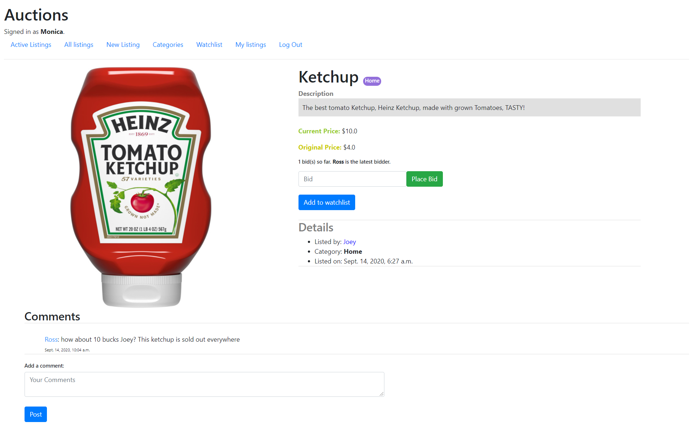
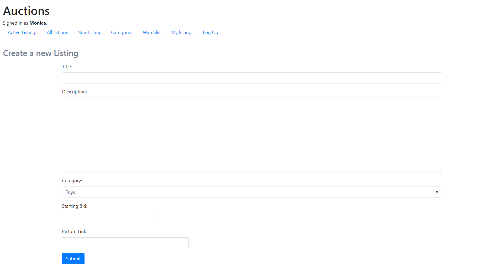
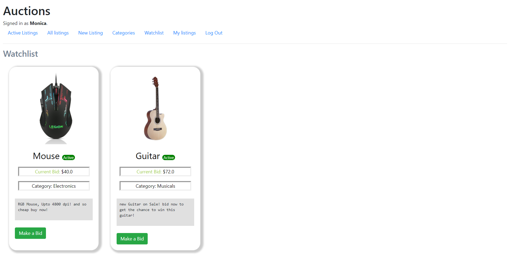

# Title: Auctions (An E-commerce website where the auctions happen)

## 1. Methodology 

## 2. Description and features
This is an E-commerce website built with **Python(Django)** as backend, **HTML**, **CSS** as Front-end and using the default sqlite database.  
No **Javacript** was used to build this project.  
This is an E-commerce website where you can post the things you want to sell, and you can also see/buy the things that other people have posted and can also bid on those products and the highest bidder will win the auction.  
There are many features of this website as shown with the screenshots below.
***

#### Features

1. Login:
To place a new listing or to bid upon something and to use much other features you have to login onto this website.

2. Register:
In order to login to the website you have to first register on the website and make your account.
   
3. Active Listings:
Here are the those listings listed which are currently active.
   
4. All Listings:
Here are all the listings which were once posted onto the website which are now closed or open.
   
5. New Listing:
Once you have logged in to the website you can now post the item you want to sell and can set the starting bid price, and can also give the link to the display picture of the listing.
   
6. Watchlist:
Here those items will appear which you decided to put on the watch by clicking the *Add to Watchlist* button.  
   
7. My Listings:
The items you posted appear here.
 
## 3. Input/Output'
We can place bids on the listings on the website as input and output.
1. Opening Listing:
If you want to place a bid or just want to open the listing just click on the make a bid button or the name of the listing, then you will be opening the listing.
#### Without login

#### With login

#### Different user listing

The listings you have posted you can also close those listings if you wish so and the highest bidder will be winning that item.

You can also comment on the listings, but you have to login first to comment.

2. Database tables:
these are the tables made inorder to create this website.

## 4. Live Link
[Live Link](http://architkapoor13.pythonanywhere.com/)

## 5. Screenshots

## 6. Video
[Auction](https://www.youtube.com/watch?v=zfJINDrpbqo)

